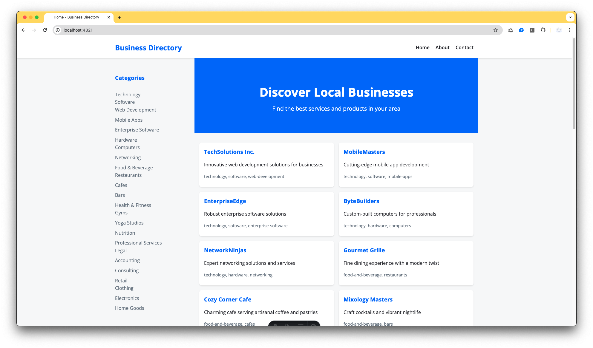
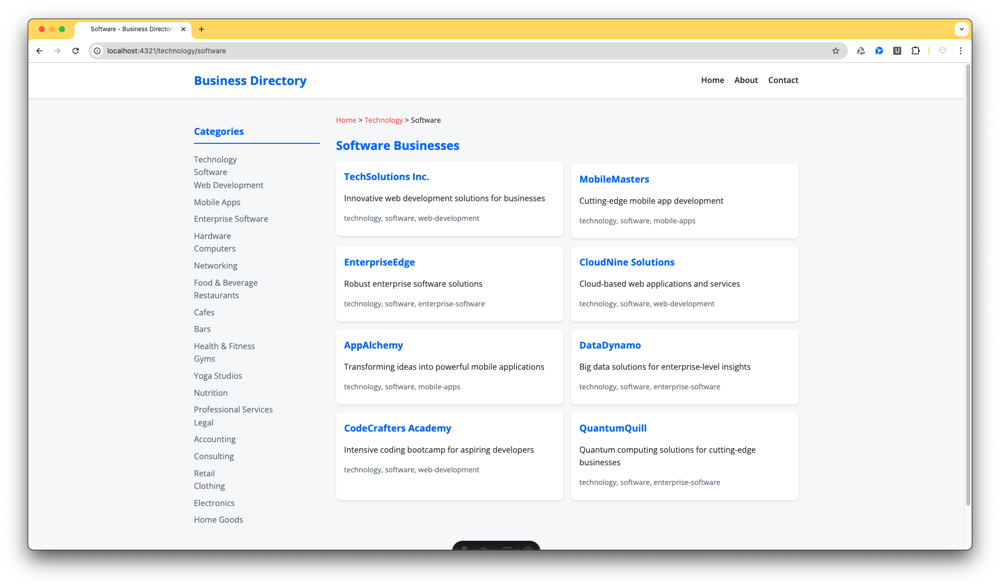
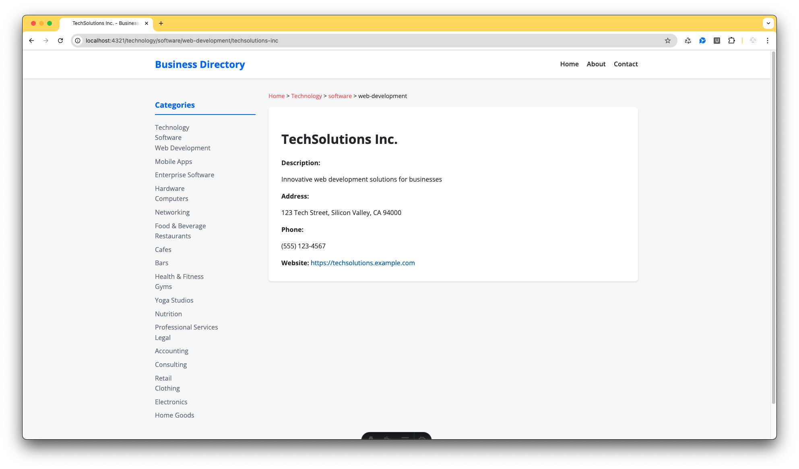

# Business Directory

Welcome to the Business Directory project! This Astro-based project aims to provide a comprehensive directory for businesses, organized by categories and subcategories. It includes features such as dynamic category pages, breadcrumb navigation, and a centralized layout.

## 🚀 Project Overview

This project is built with [Astro](https://astro.build), a modern static site generator. The directory helps connect users with local businesses, providing an easily navigable interface for finding various business categories.

### Key Features

1. **Dynamic Category Pages**: Automatically generated pages for each category and subcategory.
2. **Breadcrumb Navigation**: Helps users understand their current location within the category hierarchy.
3. **Business Listings**: Detailed pages for each business with relevant information.
4. **Responsive Design**: Ensures a great user experience on both desktop and mobile devices.

### Technology Stack

- **Astro**: For static site generation and routing
- **TypeScript**: For type-safe JavaScript code
- **JSON**: For data storage (categories and business listings)
- **CSS**: For styling (mention any CSS frameworks if used)

### URL Structure

The project uses SEO-friendly URL structures for category and business listing pages:

1. Category Pages:
   - Main categories: `/[category]`
   - Subcategories: `/[category]/[subcategory]`
   - Sub-subcategories: `/[category]/[subcategory]/[sub-subcategory]`
   
   Examples:
   - `/restaurants`
   - `/restaurants/italian`
   - `/restaurants/italian/pizza`

   The category structure supports multiple levels of nesting, allowing for a detailed and organized hierarchy of business types.

2. Business Listing Pages:
   - `/business/[slug]`
   
   Example:
   - `/business/joes-pizza-place`

   Business listings are always at the root of the `/business/` path, regardless of their category depth.

3. Category Listing Pages:
   Each category page displays:
   - A list of businesses within that category
   - Subcategories (if any)
   - A breadcrumb navigation showing the current category path

4. Dynamic Routing:
   The `[category].astro` and `[...category].astro` files handle the dynamic routing for all category depths. This allows for:
   - Consistent layout across all category levels
   - Easy addition of new categories without creating new files

5. Data Structure:
   The category hierarchy is defined in the `public/categories.json` file, allowing for easy updates and maintenance of the category structure.

This URL and routing structure ensures:
- Easy navigation for users
- Improved search engine optimization
- Scalability for adding new categories or subcategories
- Consistent user experience across all category depths

## Project Structure

Here's an overview of the project structure:

```plaintext
/
├── public/
│   ├── businesses.json  # Data file containing list of businesses
│   ├── categories.json  # Data file containing categories and subcategories
│   └── favicon.svg
├── src/
│   ├── components/
│   │   └── BusinessList.astro  # Component for displaying businesses
│   ├── layouts/
│   │   └── Layout.astro  # Main layout file
│   ├── pages/
│   │   ├── [category].astro  # Main category page
│   │   ├── [...category].astro  # Nested category page
│   │   ├── about.astro  # About page
│   │   ├── contact.astro  # Contact page
│   │   ├── index.astro  # Home page
│   │   └── business/
│   │       └── [...slug].astro  # Business detail page
│   └── types.ts  # TypeScript definitions
├── .gitignore
├── astro.config.mjs  # Astro configuration
├── package-lock.json
├── package.json
└── tsconfig.json
```

## 🛠 Installation & Development

To set up and run this project locally, follow these steps:

1. **Clone the repository:**

   ```sh
   git clone https://github.com/dodyw/astro-business-directory.git
   cd astro-business-directory
   ```

2. **Install dependencies:**

   ```sh
   npm install
   ```

3. **Run the development server:**

   ```sh
   npm run dev
   ```

   The development server will start at `http://localhost:4321`.

## 🚀 Build & Deploy

To build the project for production, run:

```sh
npm run build
```

This will generate the static files in the `dist` directory. To preview the build locally, you can run:

```sh
npm run preview
```

## 🌱 Data Seed

This project uses two JSON files to seed the data for categories and businesses:

### 1. categories.json

Located at `public/categories.json`, this file defines the hierarchical structure of business categories. It is an array of objects, where each object represents a category. Each category has the following properties:

- `id`: A unique identifier for the category.
- `name`: The name of the category.
- `parent`: The id of the parent category. If a category has no parent, this property is `null`.
- `children`: An array of ids of the child categories. If a category has no children, this property is an empty array.

Example:

```
[
  {
    "id": "1",
    "name": "Food",
    "parent": null,
    "children": ["2", "3"]
  },
  {
    "id": "2",
    "name": "Fast Food",
    "parent": "1",
    "children": []
  },
  {
    "id": "3",
    "name": "Fine Dining",
    "parent": "1",
    "children": []
  }
]
```

### 2. businesses.json

Located at `public/businesses.json`, this file contains the details of the businesses. It is an array of objects, where each object represents a business. Each business has the following properties:

- `id`: A unique identifier for the business.
- `name`: The name of the business.
- `description`: A brief description of the business.
- `address`: The address of the business.
- `phone`: The phone number of the business.
- `website`: The website of the business.
- `category`: An array of ids of the categories the business belongs to.

Example:

```
[
  {
    "id": "1",
    "name": "McDonald's",
    "description": "Fast food restaurant",
    "address": "123 Main St",
    "phone": "123-456-7890",
    "website": "https://www.mcdonalds.com",
    "category": ["2"]
  },
  {
    "id": "2",
    "name": "The French Laundry",
    "description": "Fine dining restaurant",
    "address": "123 French Laundry Rd",
    "phone": "123-456-7890",
    "website": "https://www.frenchlaundry.com",
    "category": ["3"]
  }
]
```

## 🌐 Demo

Check out the live demo of the project [here](http://astro-business-directory-demo.s3-website-us-east-1.amazonaws.com/).

## 📸 Screenshots

Here are some screenshots of the project:

1. 
2. 
3. 

## 📋 License

This project is licensed under the MIT License.

## 🤝 Contributing

Contributions, issues, and feature requests are welcome! Feel free to check the [issues page](https://github.com/dodyw/astro-business-directory/issues).

## 🙏 Acknowledgements

- [Astro](https://astro.build)
- [Open Sans Font](https://fonts.google.com/specimen/Open+Sans)

## 🎉 Credits

&copy; 2024 Business Directory. All rights reserved. Developed by [Nicecoder.com](https://nicecoder.com).
